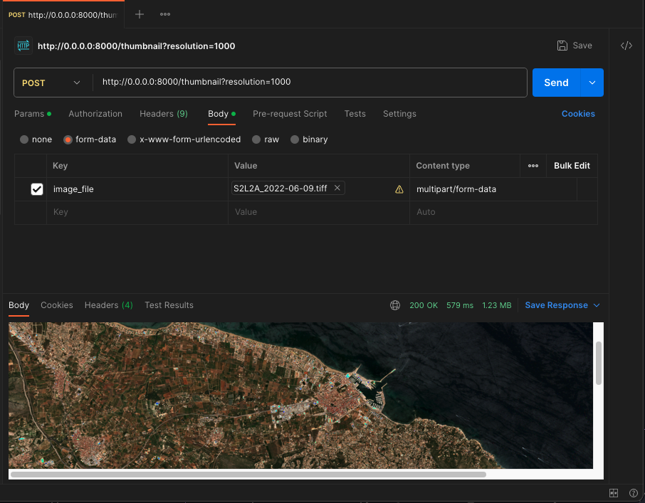

# FastAPI Backend Application - Getting Started

This guide provides instructions on how to set up and run the FastAPI backend application, as well as how to test it locally and in a Docker container.

## Prerequisites

- Python 3.10
- Docker

## Setup

1. Clone the repository to your local machine.

   ```bash
   git clone ...
   ```

2. Navigate to the project directory.

   ```bash
   cd backend
   ```

3. Install the required Python packages.

   ```bash
   pip install -r requirements.txt
   ```

## Running the Application Locally

To run the FastAPI application locally, use the following command:

```bash
uvicorn src.main:app --host 0.0.0.0 --port 8000 --reload
```

The application will be accessible at `http://localhost:8000`.

## Running Tests

To run tests for the backend application, execute the following command from the project directory:

```bash
.venv/bin/python3.10 -m pytest
```

This will run the tests and report the results. 

> Note: The application does not need to be running in order for the tests to pass since they are unit tests for the functions, not the endpoints.

## Running the Application in a Docker Container

If you want to run the application inside a Docker container, follow these steps:

1. Build a Docker image for the application using the provided Dockerfile.

   ```bash
   docker build -t earthpulse-be -f Dockerfile .
   ```

2. Run the Docker container, exposing port 8000 on your local machine.

   ```bash
   docker run -p 8000:8000 earthpulse-be
   ```

The application will be accessible at `http://localhost:8000`.

## Testing the Application

You can test the application in your web browser or by using API clients like Postman or cURL. Use the provided endpoints to interact with the application:

- `/`: The root endpoint to check if the application is running.

- `/attributes`: Upload an image file and retrieve its attributes.

- `/thumbnail`: Upload an image file and generate a thumbnail with an optional resolution setting.

Example using Postman:



---

# Running the Application in Kubernetes with Minikube

To deploy and run the FastAPI backend application in a Kubernetes cluster using Minikube, follow these steps:

## Prerequisites

- [Minikube](https://minikube.sigs.k8s.io/docs/start/) installed on your local machine.
- Docker installed and configured to work with Minikube.

## Steps to Deploy in Kubernetes

1. Start Minikube to create a local Kubernetes cluster.

   ```bash
   minikube start
   ```

2. Change your current context to the Minikube cluster. This ensures you are working in the Minikube cluster context.

   ```bash
   kubectl config use-context minikube
   ```

3. Navigate to the directory containing your Kubernetes resources.

   ```bash
   cd k8s
   ```

4. Create the Kubernetes resources (Deployment and Service) from the YAML manifest files using `kubectl apply`.

   ```bash
   kubectl apply -f .
   ```
> Note: The pod will crash because it cannot find the image.

5. To enable the pod to use the image, set the environment variables to configure Docker to use the Minikube Docker daemon:

   ```bash
   eval $(minikube docker-env)
   ```

6. Build the Docker image with the Minikube Docker daemon. This step ensures that the image is available within the Minikube cluster.

   ```bash
   docker build -t earthpulse-be -f Dockerfile .
   ```

7. Wait for the Kubernetes pods to see and use the image. You can check the status of the pods by running:

   ```bash
   kubectl get pods
   ```

   Wait until the pods are in the `Running` state.

8. Once the pods are running, you can open a Minikube service to access the application:

   ```bash
   minikube service earthpulse-be-app-service
   ```

   This command will open the service in your default web browser. If you prefer to use a different browser, you can specify it as an argument to the command.

The FastAPI backend application should now be running in your Minikube cluster, and you can interact with it using the exposed service.

## Cleanup

When you're done testing the application in Minikube, you can stop and delete the Minikube cluster:

```bash
minikube stop
minikube delete
```

## Monitoring
In a production environment, monitoring your application is crucial to ensure its health and performance. Kubernetes provides various tools and integrations for monitoring your services. Here are a few considerations for monitoring:

- Kubernetes Dashboard: Kubernetes offers a web-based dashboard for visualizing the health and status of your cluster, including your application.

- Prometheus: You can use Prometheus for collecting and storing time-series data, making it a powerful tool for monitoring applications running in Kubernetes.

- Grafana: Grafana can be integrated with Prometheus to create visually appealing dashboards, allowing you to monitor key performance metrics and alerts.

- Logging: Implementing a centralized logging solution like the ELK (Elasticsearch, Logstash, Kibana) stack can help you track and analyze logs generated by your application.

## Scalability

In production, applications often face varying levels of traffic. To handle increased load and provide high availability, you can scale your application by adjusting the number of replicas in your deployment. Kubernetes makes it easy to scale your application up or down dynamically, allowing you to distribute incoming requests across multiple instances of your application.

For high scalability, you can also consider implementing an Ingress resource. An Ingress resource acts as an entry point for your cluster and provides a way to route external HTTP and HTTPS traffic to different services within your Kubernetes cluster. By configuring Ingress rules, you can efficiently manage and route traffic to different services or replicas of your application, allowing you to achieve high scalability and load balancing.
